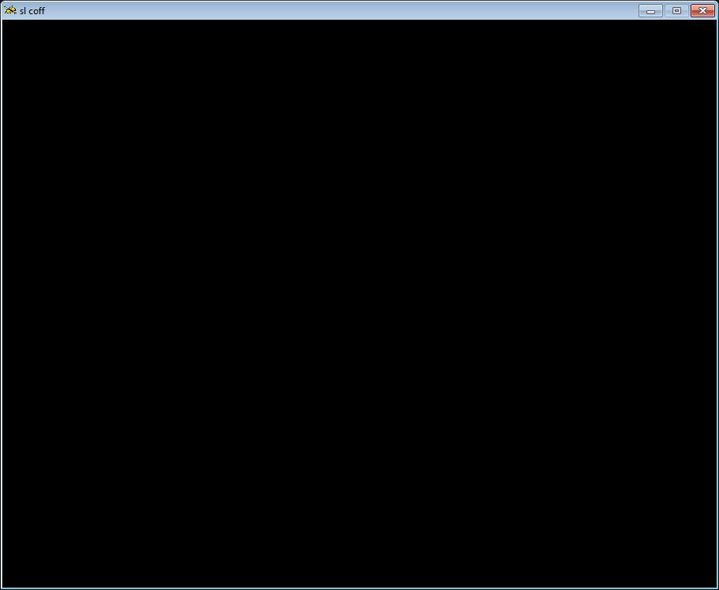

# Jo Engine Initialization and Primary Game Loop

This example provides the bare essential code for running Jo Engine. For this you will need:
- [Jo Engine](../Jo_Engine.md)
- [Creating Disc Images in the Jo Engine Environment](../Creating_Disc_Images_in_the_Jo_Engine_Environment/page.md)

## With A Callback (Standard Method)

```
/*
** Jo Sega Saturn Engine
** Copyright (c) 2012-2017, Johannes Fetz (johannesfetz@gmail.com)
** All rights reserved.
**
** Redistribution and use in source and binary forms, with or without
** modification, are permitted provided that the following conditions are met:
**     * Redistributions of source code must retain the above copyright
**       notice, this list of conditions and the following disclaimer.
**     * Redistributions in binary form must reproduce the above copyright
**       notice, this list of conditions and the following disclaimer in the
**       documentation and/or other materials provided with the distribution.
**     * Neither the name of the Johannes Fetz nor the
**       names of its contributors may be used to endorse or promote products
**       derived from this software without specific prior written permission.
**
** THIS SOFTWARE IS PROVIDED BY THE COPYRIGHT HOLDERS AND CONTRIBUTORS "AS IS" AND
** ANY EXPRESS OR IMPLIED WARRANTIES, INCLUDING, BUT NOT LIMITED TO, THE IMPLIED
** WARRANTIES OF MERCHANTABILITY AND FITNESS FOR A PARTICULAR PURPOSE ARE
** DISCLAIMED. IN NO EVENT SHALL Johannes Fetz BE LIABLE FOR ANY
** DIRECT, INDIRECT, INCIDENTAL, SPECIAL, EXEMPLARY, OR CONSEQUENTIAL DAMAGES
** (INCLUDING, BUT NOT LIMITED TO, PROCUREMENT OF SUBSTITUTE GOODS OR SERVICES;
** LOSS OF USE, DATA, OR PROFITS; OR BUSINESS INTERRUPTION) HOWEVER CAUSED AND
** ON ANY THEORY OF LIABILITY, WHETHER IN CONTRACT, STRICT LIABILITY, OR TORT
** (INCLUDING NEGLIGENCE OR OTHERWISE) ARISING IN ANY WAY OUT OF THE USE OF THIS
** SOFTWARE, EVEN IF ADVISED OF THE POSSIBILITY OF SUCH DAMAGE.
*/

#include <jo/jo.h>

//  Primary Logic Loop
void primary_loop(void)
{
	/*
	YOUR CODE HERE
	*/
}

void jo_main(void)
{
	//  Initialize engine with black background
	jo_core_init(JO_COLOR_Black);	

	//	Main loop of game
	jo_core_add_callback(primary_loop);	
	jo_core_run();
}

```

The opening block comment giving the Copyright and Licensing agreement for Jo Engine should be retained in any file that makes calls to Jo Engine, if not for moral reasons, then at least for legal ones. This section describes how you are permitted to use Johannes Fetz's code, what liability he has on what you make using it, and restrictions on the distribution of said source code (and by extenstion, anything you make that requires it to run.)

```jo_main()``` is the necessary main function that is run when the code is compiled and run on the Sega Saturn. ```jo_core_init()``` serves to initialize the game engine. The argument ```JO_COLOR_Black``` gives a default black background color before anything is drawn to the screen. Other colors may be selected from the [Jo Engine Documentation](https://jo-engine.org/doxygen/colors_8h.html).

```jo_core_add_callback(primary_loop)``` tells the engine to run the function ```primary_loop()``` every update as a callback. ```primary_loop()``` is where essentially all game logic will take place. It is initialized first so that the call to it in  ```jo_main()``` is possible. This is the top level logic of your game and should be responsible for calling all functions (and functions that call other functions, etc.) 

The blank line at the end of the file is required by the compiler and should be retained.

The make file, a necessary set of instructions for the compiler, is shown below.

```
JO_COMPILE_WITH_VIDEO_MODULE = 0
JO_COMPILE_WITH_BACKUP_MODULE = 0
JO_COMPILE_WITH_TGA_MODULE = 0
JO_COMPILE_WITH_AUDIO_MODULE = 0
JO_COMPILE_WITH_3D_MODULE = 0
JO_COMPILE_WITH_PSEUDO_MODE7_MODULE = 0
JO_COMPILE_WITH_EFFECTS_MODULE = 0
JO_COMPILE_WITH_RAM_CARD_MODULE = 0
JO_GLOBAL_MEMORY_SIZE_FOR_MALLOC = 262144
JO_DEBUG = 0
SRCS = main.c
JO_ENGINE_SRC_DIR=../../jo_engine
COMPILER_DIR=../../Compiler
include $(COMPILER_DIR)/COMMON/jo_engine_makefile
```

Because this example is for only the most basic functionality, all optional modules are deactivated (set to ```0```.) The memory size setting ```JO_GLOBAL_MEMORY_SIZE_FOR_MALLOC = 262144``` is a value found by **XL2** that functions for his code, and is kept as a vestigial compatibility for any potential ```malloc()``` operations. ```SRCS``` tells the compiler which source files (.c) are to be included in the build. This is not necessary for header (.h) as the include statements (such as ```#include <jo/jo.h>```) are pulled in with source files. The final three lines give a directory structure to find the compiler and engine files required by the Jo Engine environment. As written, the code needs to be in a subdirectory two levels down from the parent. ```\JO Engine\Projects\[YOUR-CODE-FOLDER-NAME]``` is recommended as a working folder.

This code should result in a black screen after startup.



## Without A Callback (Standard Method)

**```main.c```:**
```
/*
** Jo Sega Saturn Engine
** Copyright (c) 2012-2017, Johannes Fetz (johannesfetz@gmail.com)
** All rights reserved.
**
** Redistribution and use in source and binary forms, with or without
** modification, are permitted provided that the following conditions are met:
**     * Redistributions of source code must retain the above copyright
**       notice, this list of conditions and the following disclaimer.
**     * Redistributions in binary form must reproduce the above copyright
**       notice, this list of conditions and the following disclaimer in the
**       documentation and/or other materials provided with the distribution.
**     * Neither the name of the Johannes Fetz nor the
**       names of its contributors may be used to endorse or promote products
**       derived from this software without specific prior written permission.
**
** THIS SOFTWARE IS PROVIDED BY THE COPYRIGHT HOLDERS AND CONTRIBUTORS "AS IS" AND
** ANY EXPRESS OR IMPLIED WARRANTIES, INCLUDING, BUT NOT LIMITED TO, THE IMPLIED
** WARRANTIES OF MERCHANTABILITY AND FITNESS FOR A PARTICULAR PURPOSE ARE
** DISCLAIMED. IN NO EVENT SHALL Johannes Fetz BE LIABLE FOR ANY
** DIRECT, INDIRECT, INCIDENTAL, SPECIAL, EXEMPLARY, OR CONSEQUENTIAL DAMAGES
** (INCLUDING, BUT NOT LIMITED TO, PROCUREMENT OF SUBSTITUTE GOODS OR SERVICES;
** LOSS OF USE, DATA, OR PROFITS; OR BUSINESS INTERRUPTION) HOWEVER CAUSED AND
** ON ANY THEORY OF LIABILITY, WHETHER IN CONTRACT, STRICT LIABILITY, OR TORT
** (INCLUDING NEGLIGENCE OR OTHERWISE) ARISING IN ANY WAY OUT OF THE USE OF THIS
** SOFTWARE, EVEN IF ADVISED OF THE POSSIBILITY OF SUCH DAMAGE.
*/

#include <jo/jo.h>

//  Primary Logic Loop
void primary_loop(void)
{
	while(1)
	{
		/*
		YOUR CODE HERE
		*/
	}
}

void jo_main(void)
{
	//  Initialize engine with black background
	jo_core_init(JO_COLOR_Black);	

	//	Main loop of game
	primary_loop();	
}

```

When ```primary_loop()``` is called, the ```while(1)``` condition starts and, provided the program does not crash, never stops. For normal game operation, you will never want to exit or break this loop, as the Saturn will simple stop doing anything. For an "exit game" or "return to title" feature, games states should be used (covered separately.)

This approach, avoiding Jo Enging callbacks, is required for compatibility with [Z-Treme Tools](../Z-Treme_Tools/Z-Treme_Tools.md). This will, however, break certain functions such as ```jo_printf()``` and ```jo_get_ticks``` that rely on the callback sttructure.

[Back](../Jo_Engine.md)
